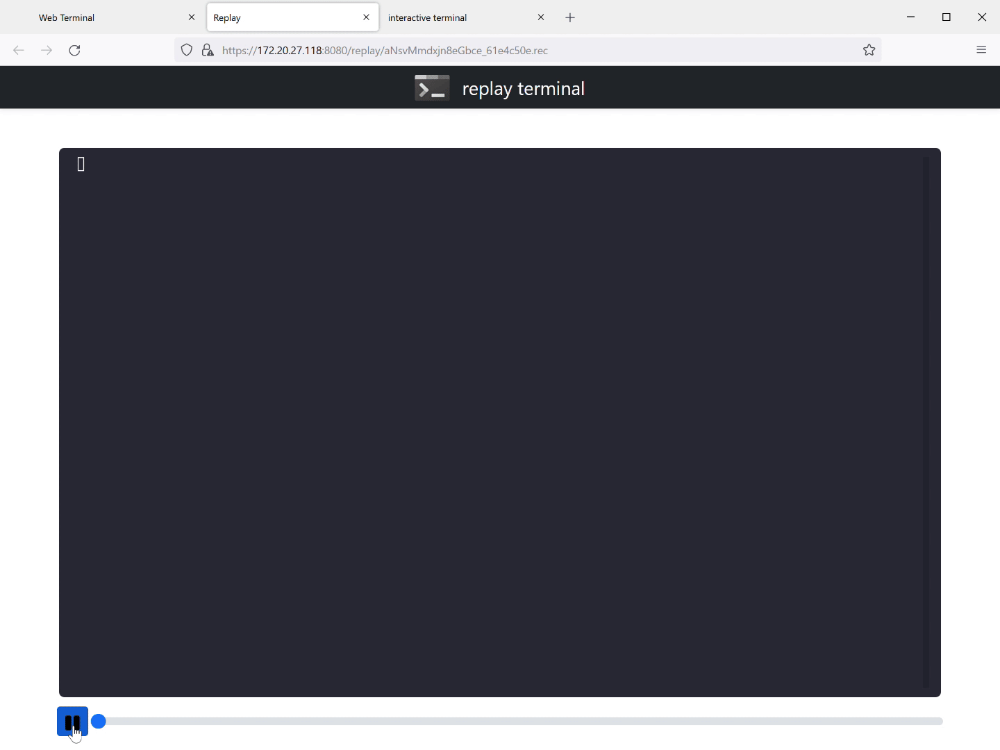
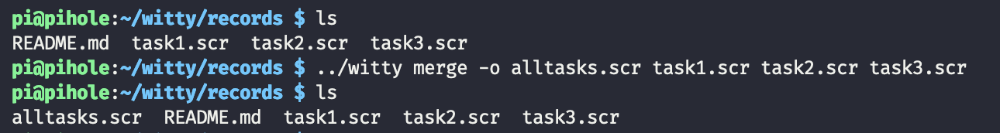
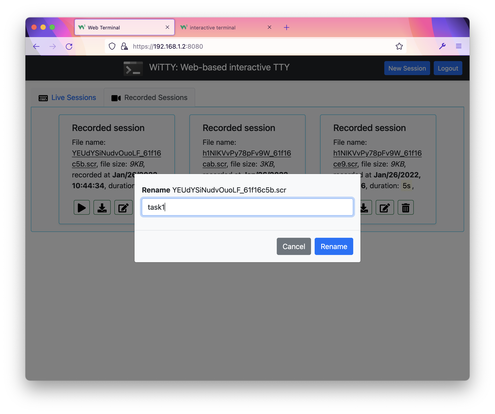

<mark>**WiTTY: Web-based interactive TTY**<mark>

# Introduction

This program allows you to use terminal in the browser. Simply run the program and give it the command to execute when users connect via the browser. The design goal of this tool is to help teaching courses that use Unix-like CLI environment. WiTTY has the following features that distinguish itself from other similar tools:

1. WiTTY allows users to **easily record, replay, and share console sessions** with just a few clicks. This make it a breeze to answer course-related questions. Instead of wall of text to describe their questions, students can just send a recorded session. 
   
2. It allows others to **view ongoing interactive sessions**. This is useful for providing live remote help. 

   >A challenge of this use case is that our home networks are almost always behind NAT, making it difficult to run WiTTY as a publicly accessible server. Security is also potentially a concern.

3. Great attention has been paid to ensure the cleanses of the code. This, hopefully, provides a useful example of **Do as I say and as I do**. 

# User Interface

You can use WiTTY to run any command line programs, such as ```bash```, ```htop```, ```vi```, ```ssh```. This screenshot shows the main page of WiTTY after login. There are two tabs that list live and recorded sessions, respectively. You can click ```New Session``` to create a new interactive session. Click the  icon of an interactive session opens a read-only view of that session. 
   


On the interactive terminal window, you can record an ongoing session. 


This screenshot shows three recorded sessions, you can replay , download , rename , and delete  recorded sessions. 


Here is a recorded session, where we domonstrate how to use the command line replay utility (in ```cmd/replay```) to replay another recorded session that sshes into a Raspberry Pi running 
[pi-hole](https://pi-hole.net/). You can fully control the playback using the progress bar.

>The inception is strong with this one!

&nbsp;&nbsp;&nbsp;&nbsp;&nbsp;&nbsp;


<!-- 
commands to create high quality gif from mkv/mp4 files
ffmpeg -i replay.mkv -vf palettegen palette.png
ffmpeg -i replay.mkv -i palette.png -lavfi paletteuse output.gif
gifsicle -O3 .\output.gif -o replay.gif
-->


This program is written in the [go programming language](https://go.dev/), using the 
[Gin web framework](https://github.com/gin-gonic/gin), [gorilla/websocket](https://github.com/gorilla/websocket), [pty](https://github.com/creack/pty), and the wonderful [xterm.js](https://xtermjs.org/)!
The workflow is simple, the client will initiate a terminal 
window (xterm.js) and create a websocket with the server, which relays the data between pty and xterm. You can customize the look and feel of the HTML pages by editing files under the ```assets``` directory.

The program has been tested on Linux, WSL2, Raspberry Pi 3B (Debian), and MacOSX using Google Chrome, Firefox, and Safari.

Most icons were provided by [fontawesome](https://fontawesome.com/) under this [license](https://fontawesome.com/license).

# Installation

1. Install the [go](https://go.dev/) compiler. __Make sure you have go 1.17 or higher.__ 

2. Download the release and unzip it, or clone the repo
   
   ```git clone https://github.com/syssecfsu/witty.git```

3. Go to the root directory of the source code and build the program. WiTTY uses go:embed to embed assets in the binary. Remember to build WiTTY after changing templates.
   
   ```go build .```

4. WiTTY uses TLS to protect its traffic. You can request a free [Let's Encrypt](https://letsencrypt.org/) cert or use a self-signed cert. Here is how to create a self-signed cert in the ```tls``` sub-directory:
   
   \# Generate a private key for a curve

    ```openssl ecparam -name prime256v1 -genkey -noout -out private-key.pem```

    \# Create a self-signed certificate

    ```openssl req -new -x509 -key private-key.pem -out cert.pem -days 360```

5. Add a user to the user accounts, follow the instructions on screen to provide the password
   
   ```./witty adduser <username>```

6. Start the server and give it the command to run. By default, the server listens on 8080 (you can override it with the ```-p/-port``` option):
   
   ```./witty run htop``` or

   ```./witty run -p 9000 ssh <ssh_server_ip> -l <user_name>```

   If so desired, you can disable user authenticate with ```-n/-naked```, (not recommended) for example:

   ```./witty run -naked htop```    

7. Connect to the server with your browser at port 8080 or the one specified in step 6, for example

   ```https://<witty_server_ip>:8080```

# User Authentication

WiTTY uses username/password based authentication. The user database is stored in ```user.db```. The passwords are salted with 64 bytes of random characters and then hashed using SHA256.  WiTTY has three sub-commands to manage ```user.db```. 

   - ```witty adduser <username>```
   - ```witty deluser <username>```
   - ```witty listusers```

They are pretty self-explanatory. Just follow the instructions on screen. Note that passwords must be 12 bytes or longer. 
   
# Recorded Sessions

WiTTY provides two sub-commands to merge and replay recorded sessions. 

   - ```witty replay -w <wait_time> <recorded_session>```
   - ```witty merge -o <output_file> <record1> <record2> ...```

Recorded sessions often have long delay between outputs. You can set wait_time to limit the maximum wait time between outputs, to speed up the replay. 

You can also use ```witty merge``` to merge two or more recorded sessions, as shown below.



The intended use case is to record a separate session for each individual task, rename and merge them into a final session for submission. The following screenshot shows how to rename a recorded session (you can also rename a recorded session using commands in a shell. All the recorded sessions are located under the ```records``` directory). 


