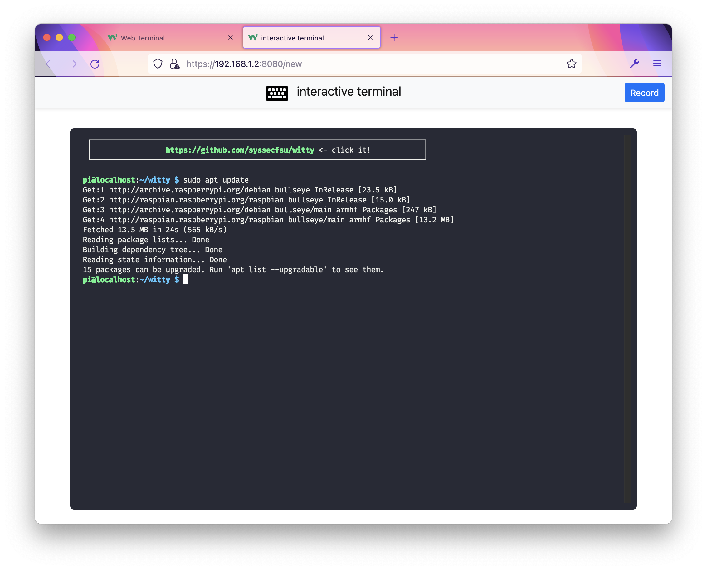

# WiTTY: Web-based interactive TTY

Read document of WiTTY at [**https://syssecfsu.github.io/witty/**](https://syssecfsu.github.io/witty/)

WiTTY allows you to use terminal in the browser. Simply run the program and give it the command to execute when users connect via the browser. WiTTY has the following features that distinguish itself from other similar tools:

1. WiTTY allows users to **easily record, replay, and share console sessions** with just a few clicks. 
   
2. It allows others to **view ongoing interactive sessions**. This is useful for providing live remote help. 

3. Great attention has been paid to ensure the cleanses of the code. This, hopefully, provides a useful counter-example of **Do as I say, but not as I do**. 

Here is a screenshot of WiTTY running on Raspberry Pi:

You can find more information at [**https://syssecfsu.github.io/witty/**](https://syssecfsu.github.io/witty/)

