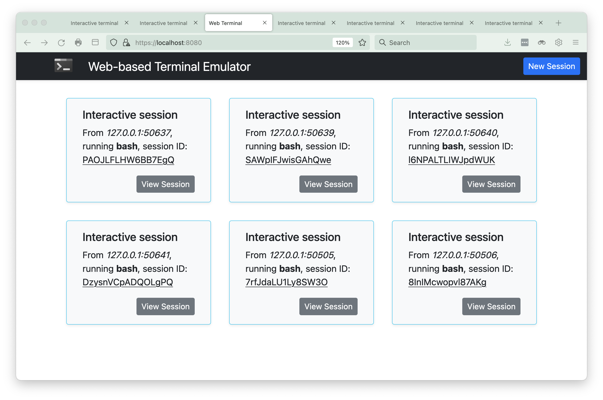
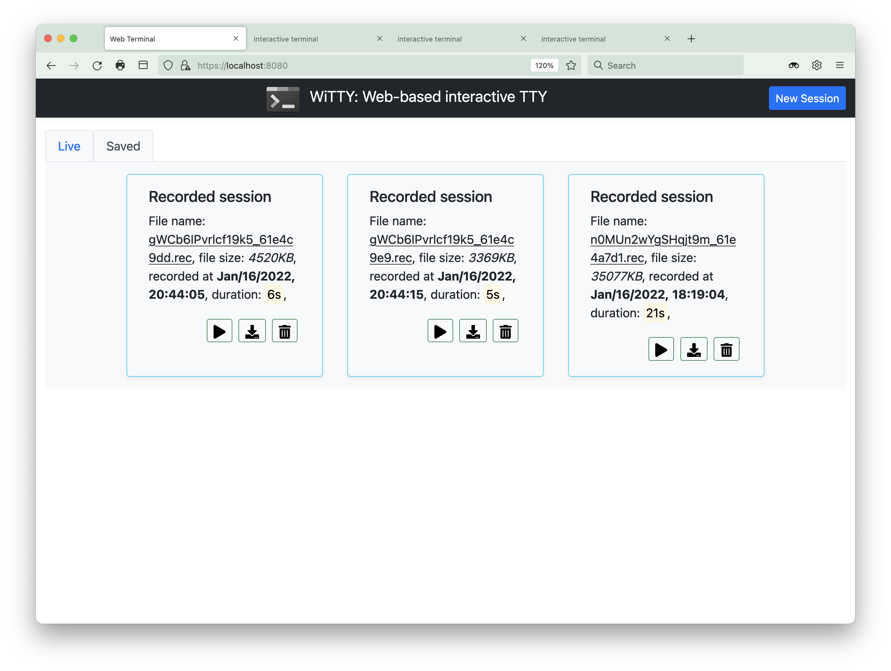

# WiTTY: Web-based interactive TTY
This program allows you to use terminal in the browser. Simply run the program and give it the command to execute when users connect via the browser. The main design goal of this tool is to help teaching courses that use Unix-like CLI environment. WiTTY has the following features that distinguish itself from other similar tools:

1. It allows others to **view onging interactive sessions**. This is useful for providing live remote support and/or help (only use this after user authentication is implemented). 

   A challenge of this use case is that our home networks are almost always behind NAT, making it diffcult to run WiTTY as a publicly accessible server. Security is also a concern. It is generally safer to use WiTTY in a trusted environment.

2. WiTTY allows users to **easily record, replay, and share console sessions** with just a few clicks. This make it a breeze to answer course-related questions, espeically with the source code. Instead of wall of text to describe their questions, students can just send a recorded session. 

   This repository contains a recorded session in the ```assets/extra``` directory ([M1NXZvHdvA8vSCKp_61e5d60f.rec](extra/M1NXZvHdvA8vSCKp_61e5d60f.rec)) that shows me upgrading pihole. Just put the file under the ```records``` directory, run the server, you should find the recording in the ```Recorded Session``` tab. 

3. More features are planned, suggestions are welcome.  

You can use WiTTY to run any command line programs, such as ```bash```, ```htop```, ```vi```, ```ssh```. This following screenshot shows that three interactive session running ```zsh``` on macOS Monterey. 

The following screenshot shows three recorded sessions. You can replay/download/delete them. 



Here is a recorded session, where we domonstrate how to use the command line replay utility (in ```cmd/replay```) to replay another recorded session that sshes into a Raspberry Pi running 
[pi-hole](https://pi-hole.net/). You can pause and seek the replay.

>The inception is strong with this one!


<!-- 
commands to create high quality gif from mkv/mp4 files
ffmpeg -i replay.mkv -vf palettegen palette.png
ffmpeg -i replay.mkv -i palette.png -lavfi paletteuse output.gif
gifsicle -O3 .\output.gif -o replay.gif
-->


To use the program, you need to provide a TLS cert. You can request a free [Let's Encrypt](https://letsencrypt.org/) cert or use a self-signed cert. By default, WiTTY authenticate users with username and password. You can add a new user using ```witty adduser <username>```, and delete an existing user with ```witty deluser <username>```. It is also possible to disable user authentication with ```-n/-naked``` to the run command. For example, ```witty run -n zsh``` will run zsh without user authentication. 

This program is written in the [go programming language](https://go.dev/), using the 
[Gin web framework](https://github.com/gin-gonic/gin), [gorilla/websocket](https://github.com/gorilla/websocket), [pty](https://github.com/creack/pty), and the wonderful [xterm.js](https://xtermjs.org/)!
The workflow is simple, the client will initiate a terminal 
window (xterm.js) and create a websocket with the server, which relays the data between pty and xterm. You can customize the look and feel of the HTML pages by editing files under the ```assets``` directory.

Most icons were provided by [fontawesome](https://fontawesome.com/) under this [license](https://fontawesome.com/license).

## Installation

1. Install the [go](https://go.dev/) compiler. __Make sure your have go 1.17 or higher.__ 
2. Download the release and unzip it, or clone the repo
   
   ```git clone https://github.com/syssecfsu/witty.git```

3. Go to the ```tls``` directory and create a self-signed cert
   
   \# Generate a private key for a curve

    ```openssl ecparam -name prime256v1 -genkey -noout -out private-key.pem```

    \# Create a self-signed certificate

    ```openssl req -new -x509 -key private-key.pem -out cert.pem -days 360```

4. Return to the root directory of the source code and build the program
   
   ```go build .```

5. Add a user to the user accounts, follow the instructions on screen to provide the password
   
   ```./witty adduser <username>```

6. Start the server and give it the command to run. The server listens on 8080, for example:
   
   ```./witty run htop``` or

   ```./witty run ssh <ssh_server_ip> -l <user_name>```

   If so desired, you can disable user authenticate with ```-n/-naked```, (not recommended) for example:

   ```./witty run -naked htop```     

7. Connect to the server, for example

   ```https://<witty_server_ip>:8080```

The program has been tested on Linux, WSL2, Raspberry Pi 3B (Debian), and MacOSX using Google Chrome, Firefox, and Safari.
